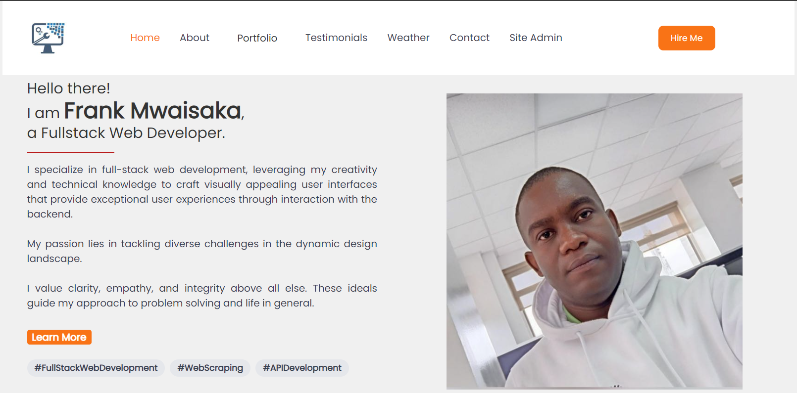

# Project: Personal Website

## Project Developer: Frank

---

## Introduction 

This is a personal website detailing my profile, skills, proficiency and accomplishments. It also have a platform for reaching out to me via email and also whatsapp. 

---

<h2 align="center">
  Portfolio Website live demo
  <a href="https://frankm-me.onrender.com/" target="_blank">Frank Mwaisaka Portfolio</a>
</h2>
<div align="center">
  
</div>

---

## Built With

This project was built using these technologies.

- React.js
- CSS3
- Tailwind CSS
- Django
- Javascript
- Python

---

## Getting Started

Clone down this repository.

---

## 🛠 Installation and Setup Instructions

To get set up, run:

```console
$ pipenv install && pipenv shell
$ npm install --prefix ds_client
$ cd ds_server
```
You can run the Django server with:

```console
$ cd ds_server
$ python migrate.py runserver
```

Note that running `migrate.py runserver` will generate an error if you haven't created
your models and run your migrations yet.

And you can run React in another terminal from the project root directory with:

```console
$ npm run dev --prefix client
```
---
## Models
#### Subscribers: 
Shows the list of subscribers

#### Tasks: 
Shows the list of tasks

#### Testimonials: 
Shows the list of user testimonials


